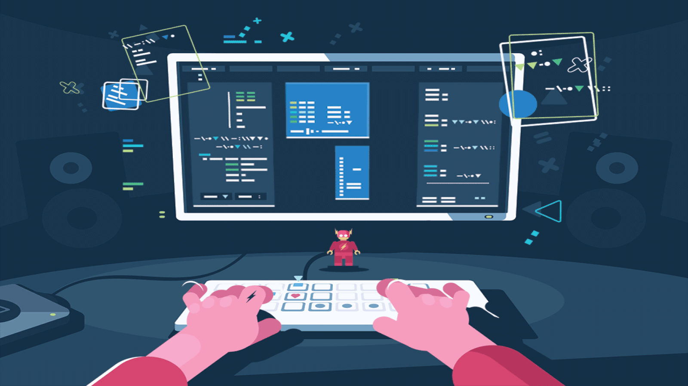
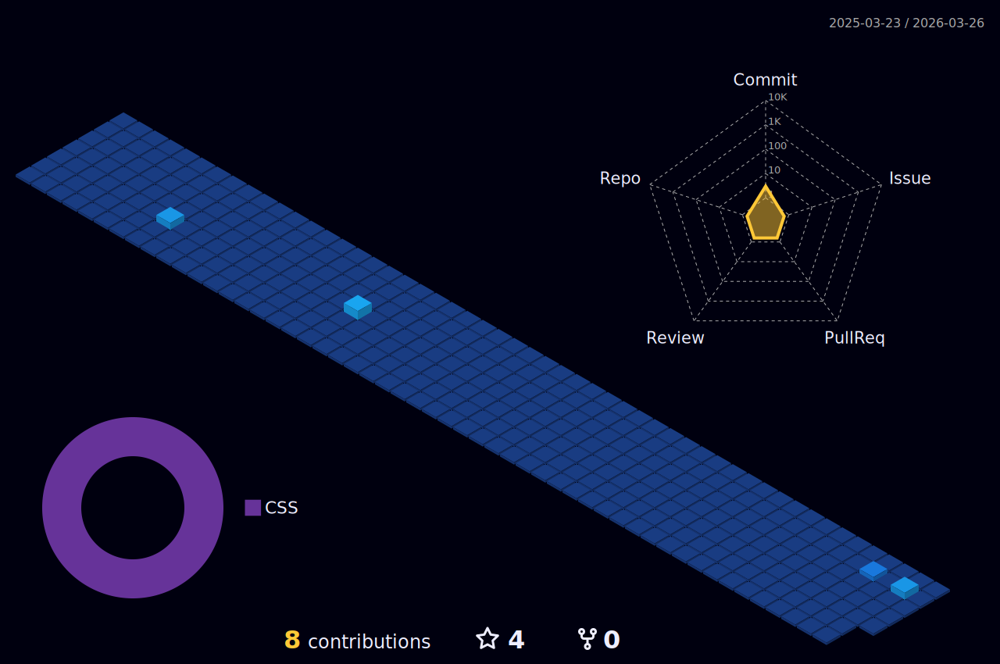

<!-- Intro  -->
<h3 align="center">
        <samp>&gt; Hey There!, I am
                <b><a target="_blank" href="https://ziyadkadekara.com">Ziyad Kadekara</a></b>
        </samp>
</h3>

 
  <samp>
    <a href="https://www.google.com/search?q=Ziyad+K">「 Google Me 」</a>
     
    「 I am a Designer - Developer - Maker 」
     
  </samp>

 
 
    
 
  
  

 

 
  
### About Me
- 🎯 &emsp; Thriving on solving puzzles and crafting elegant solutions.
- 💡 &emsp; Passionate about learning the latest tech—bugs, beware!
- 🛠️ &emsp; Always building, always tinkering.
- 🚀 &emsp; On a mission to explore new features and innovations.
- 📬 &emsp; Always open for a chat on social media—let's connect!
- 💭 &emsp; Got a question? Curious about something? [Ask me anything!](https://github.com/ziyadkadekara/ziyadkadekara/issues)
- ⭐ &emsp; Don't forget to star my projects if you find them useful!

 

<h3 align="center" > 🚀 Languages - Frameworks - Tools - Libraries - Workspace 🚀</h3>

 

    
 
## Top Open Projects -

  

  

  

<a> 
    
  
   
</a>

